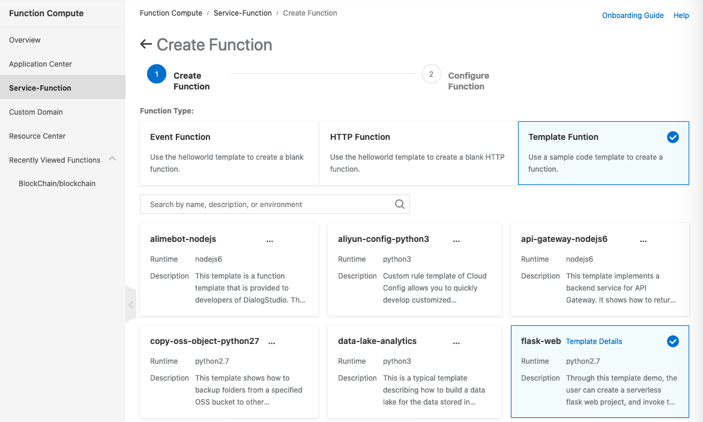
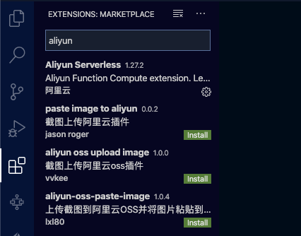
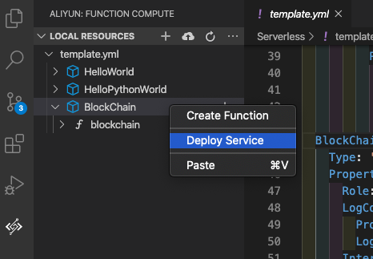

# A simple demonstration create a blockchain application on Alibaba Cloud Function Compute 

I have studied the work of blockchain by [Daniel van Flymen](https://medium.com/@vanflymen/learn-blockchains-by-building-one-117428612f46) through his [source code](https://github.com/dvf/blockchain). 

Refer to Ken Formm's [study](https://read.acloud.guru/blockchain-and-serverless-processing-similarities-differences-and-how-they-fit-together-c12142373287), serverless and blockchain can be used together. 

I have modifeid the source code and create a new class file (Blockchain.py).  Then, the main function of the function compute can import the class as a Blockchain object. 

Here I would like to share my experience developing a serverless application based on Daniel and deploy to Alibaba Cloud Function Compute.

### Step 1 Create a new function at Function Compute
As the sample is currently implement with Flask framework, the simple way is create a new function (Function Compute > Service-Function > Create Function) by selecting the "Template Function" (as follow)

### Step 2 Config the function
Follow the instructions to config the function by entering the service name, function name, function handler, memory, timeout  and instance concurrency and the trigger. 

### Step 3 Update the code by using Visual Studio Code
Visual Studio Code is an excellent tool that can implement function for function compute and debug the function locally.  It is necessary to install the Aliyun Serverless extension (as below) 

After setting up the account connected to Alibaba Cloud, you can download the new function just create at Function Compute, you found that you can implement the function in the main.py file.

### Step 3a (optional) Install Docker
If you are going to test the function locally, you need to install [Docker](https://www.docker.com).  Create a docker account and download docker application by following the instruction in the official web site.

### Step 4 Change the execute environment to Python3
You should also remember to modify the execute environment to python3 as the default template of Flask is executed by python2. (at Line 1)

    #!/usr/bin/env python3

### Step 5 Deploy to Function Compute
If the code is fine after testing, you can deploy the function by right click the function and select Deploy Service.

So, you can take a look and try with API testing tool (such as [Postman](https://www.postman.com)) :
1. Mine endpoint (url/mine) - GET request
2. Create transaction endpoint (url/transactions/new) - POST request with a JSON body as follow sample:

        {
            "sender": "my address",
            "recipient": "Others address",
            "amount": 10
        }
3. Return the full chain endpoint (url/chain) - GET request
4. Register a new node (url/nodes/register) - POST request with a JSON body as following sample:

        {
            "nodes":["http://x.x.x.x"]
        }
5. Resolve the chain with Consensus Algorithm (url/nodes/resolve) - GET request

The URL can be found in Trigger Menu under Function Compute.

